# INFO6205 Final Project - Fall 2021

## Team members

Yu An          NUID: 001523003

Lan Gao     NUID: 001568670

## Requirements

This task is to implement **MSD radix sort** for a natural language which uses Unicode characters. 
You may choose your own language or (Simplified) Chinese. Additionally, you will complete a literature survey of relevant papers and you will compare your method with **Timsort**, **Dual-pivot Quicksort**, **Huskysort**, and **LSD radix sort**. 

## Task

In the implemention of this task, we chose to compare all the methods in sorting (Simplified) Chinese.

#### MSD radix sort

In the process of implementing msd along the lines of LSD, some problems arose. The algorithm of msd is implemented recursively, splitting the array into smaller arrays after each sorting, and sorting smaller arrays next time. According to the above idea of sorting only one character of Hanzi Pinyin each time, each layer of Hanzi characters will add up to 7 more layers(mix to 6 characters and 1 number to represent tone) of sorting, and the time cost will directly rise exponentially.

In accomplishing, we converted the Chinese character array into a two-dimensional array before sorting, and stored the Chinese characters and the corresponding pinyin string. Each sort directly operates on the pinyin string, so that the whole sort is basically converted to English character sort, radix can also use the 256 ASCII code table. Time is reduced to linearithmic.

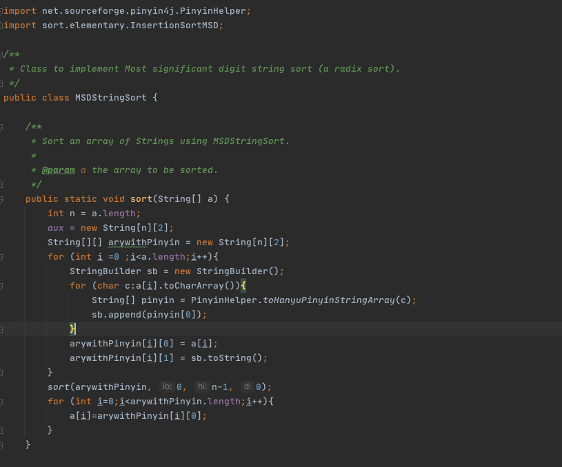

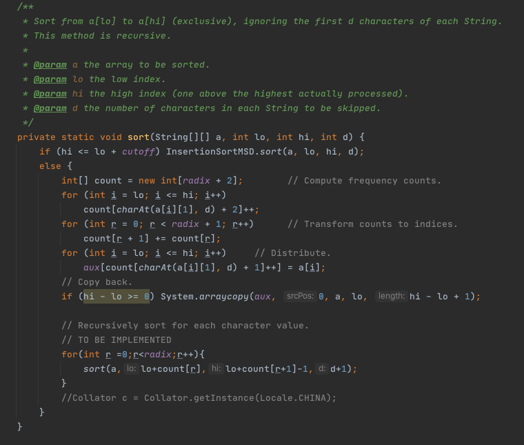

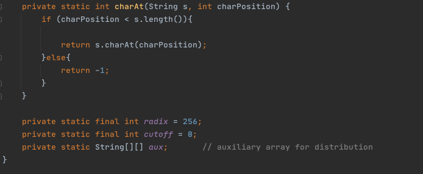

#### LSD radix sort 

LSD radix sort sorts characters in order from the rightmost character to the left through an ordered alphabet. The first idea for sorting Chinese characters is to find a coding table that exists in pinyin order, and to obtain the coding values of Chinese characters that can be sorted normally according to radix.
After searching, we found that GBK basically meets the condition - it is encoded by two bytes, ranging from 8140 to FEFE, and contains 21003 Chinese characters in total. However, during the experiment, we found that the 3755 common Chinese characters in the GBK code are in pinyin order, but the relationship between the second-level Chinese characters and the first-level Chinese characters is not in pinyin order (the first-level Chinese characters and the second-level Chinese characters are in different coding areas). 
To solve the problem, the first method is to sort the GBK table by collator, then store the GBK characters into a searchable table, and create a radix array of the same size as the table. However, this solution will take an exaggerated amount of time, and when raidx becomes 65536 (unicode) encoding, it will take thousands of times longer, so if we use the GBK encoding table, it will also take thousands of times longer.
Therefore, we need to change the way of thinking, directly through pinyin4j to get the pinyin and tone of Chinese characters, in the counting stage of each sorting, the characters will be converted into pinyin (the format of pinyin is lowercase pinyin plus tone), and then the original LSD algorithm will have one more layer of loops to deal with the sorting of individual pinyin.

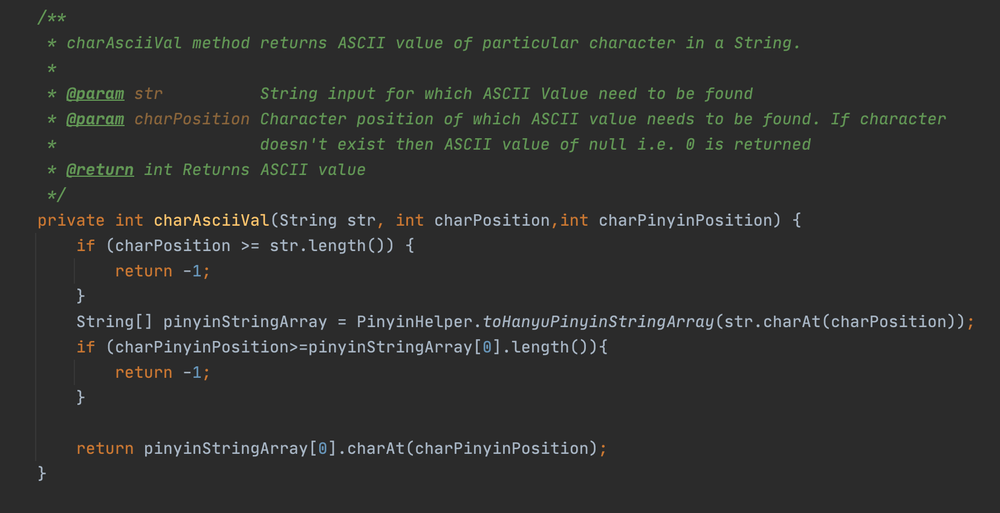

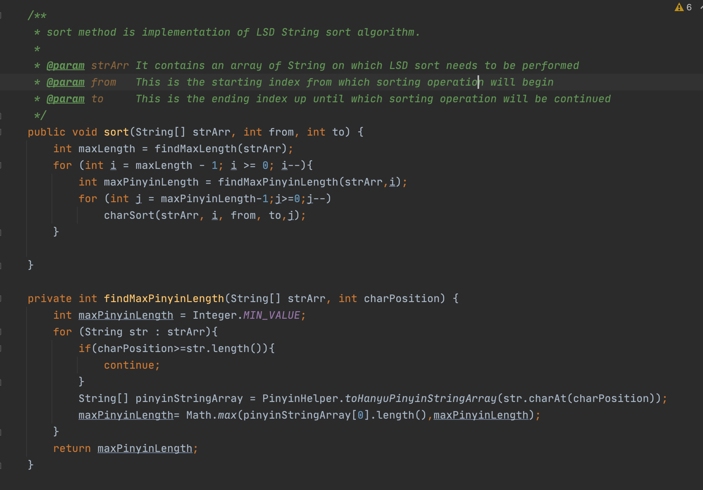

#### Huskysort

In Huskysort, we found it could convert the strings into long which is comparable directly from the original codes and paper. Therefore, we only need to find a tool that can encode Chinese, and the coding is practiced in the order of pinyin, and we can obtain comparable values.

So, through the collator class, we got comparionKey of each Chinese characters. Then obtained the Byte arrays corresponding to the key value through toByteArray(), and finally converted the long value to complete the work of the encoder.

But, during the experiment, "陈旻玥" and ""陈旻旻" have the same value after encoded, so this is not perfect. We had to set the value of perfect of coder to false in the coderfactiory class. Then used insertion sort or arrays.sort to do the second sort.

In addition, the byte values of the same encoding value are actually different. There is something left to study --- if it’s the hidden bug of byte conversion to long type that leads to imperfect encoding.

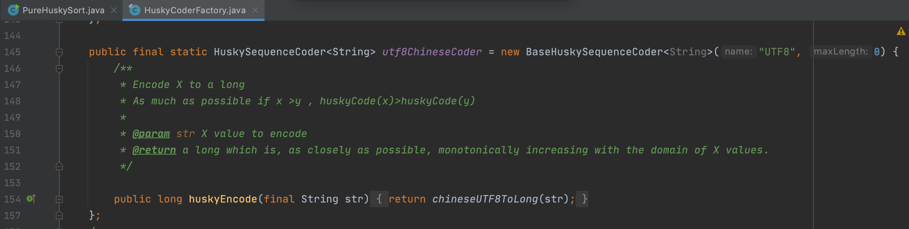

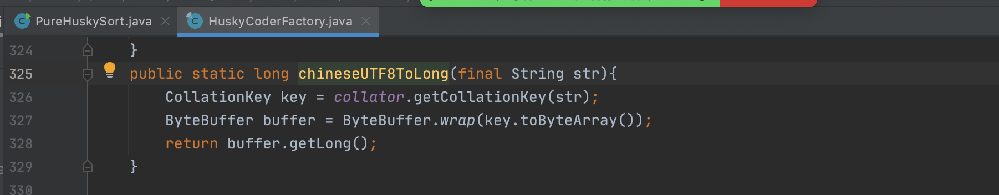

#### Timsort 

Since Timsort is already allowed to use collator to sort Chinese words, so we only need to provide collator.getInstance(Local.China) in the function.

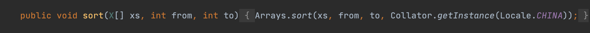

#### Dual-pivot Quicksort 

For quicksort, the only thing needed to know is the size relationship of the strings to sort them. With the collator class provided by java we can compare Chinese strings, in this case, for Quicksort, there is no difference between comparing Chinese and comparing numbers.

So we built the PinyinHelper class which extended from the helper class to accomplish the comparison of pinyin.

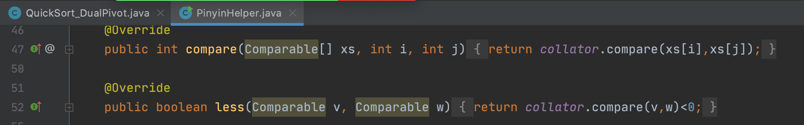

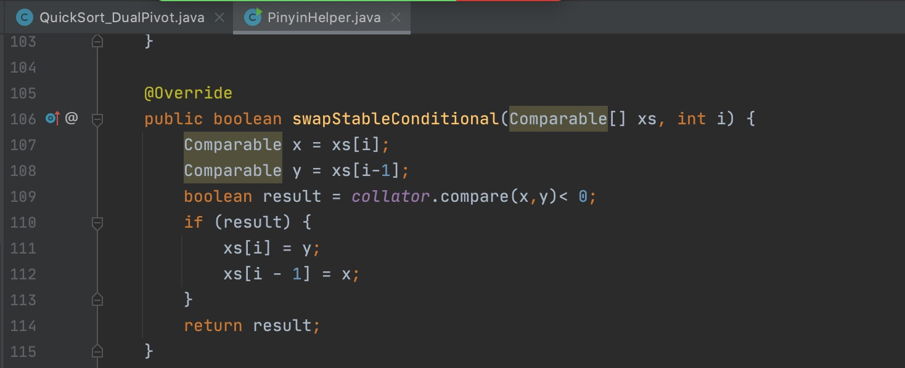

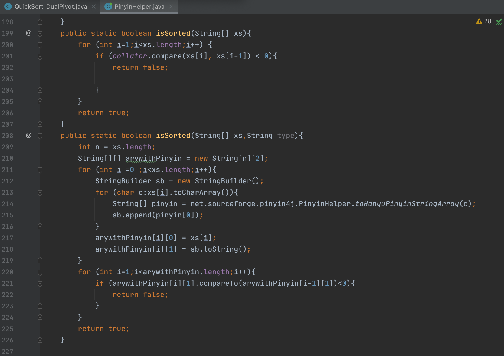

#### Benchmark

Basde on Assignment2 and the Benchmark class in Huskysort we built the benchmark class and benchmark test class for each sort methods.

Use MSD radix sort as an example:

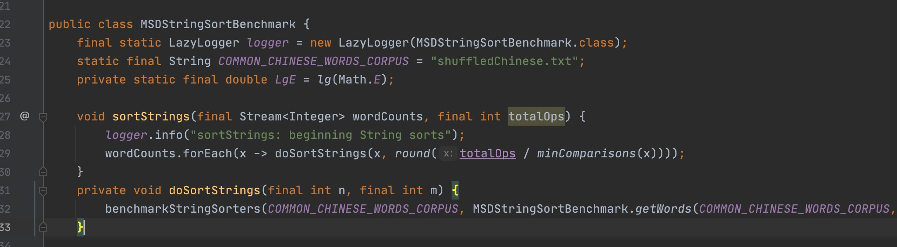

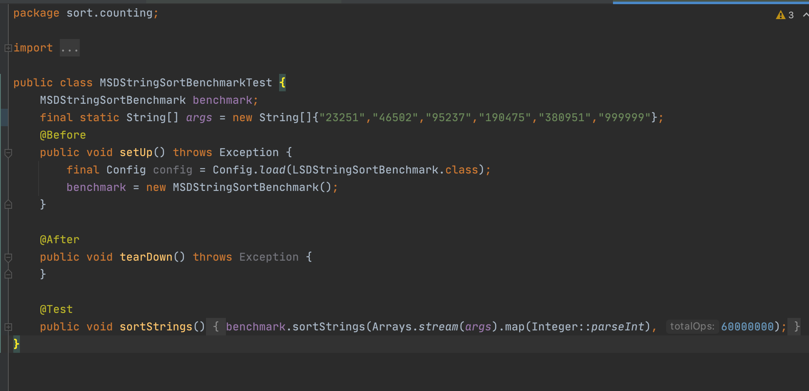

#### Unit Test

For all sort methods we created a GetUnsortedArray class to generate the array used to test. 

And there is something need to be discussed of MSD and LSD radix sort. 

To determine whether the sorting is successful or not, we directly used the compareTo method of String to determine the value of the pinyin strings. We didn't use Collator to compare, because in the case of different characters with the same sound,  MSD and LSD radix sort will keep the order before sorting, but Collator determines that these two characters are not equal, and we think our order is correct even if we only consider pinyin sorting.

For example: '滨' and '彬' have same tone and pinyin, which is " bin". Our algorithm think "滨,彬" and "彬, 滨" are the same things. but when we use Collator to compare，"滨" is larger  than "彬". but "滨,彬" and "彬, 滨" are all correct order, if we only consider pinyin order.

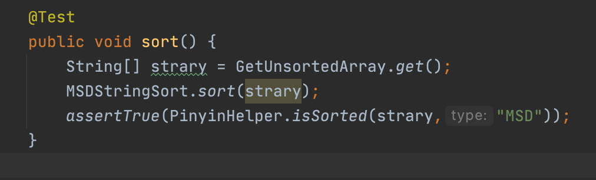

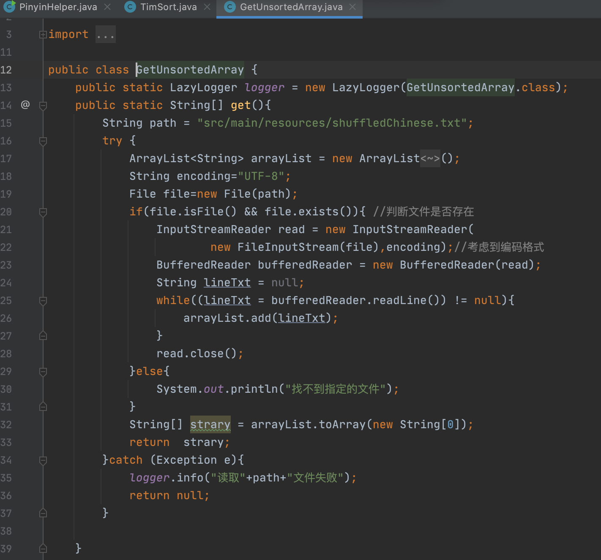

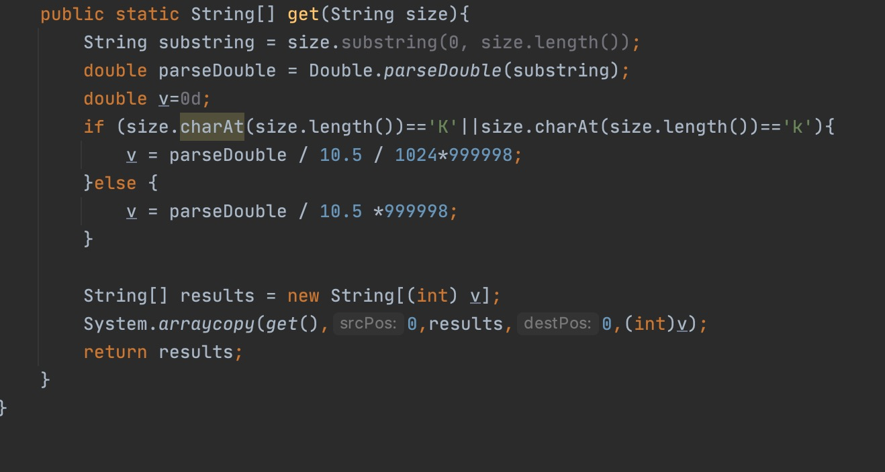

#### 

## Relationship Conclusion

From the result of sorting different sizes of Chinese names in 250k, 500k, 1M, 2M, 4M, 10M, we can see:

a. When the size of names is under 4M, the efficiency relationship among these five methods is Huskysort >MSD radix sort >Timsort >LSD radix sort >= Dual-pivot Quicksort;

b. When the size of names is over 4M, Dual-pivot Quicksort is faster than LSD radix sort；

c. As the size of names goes up, the gap of efficiency difference becomes more obvious. Huskysort and MSD radix sort have better performance.

If LSD radix sort uses the same way as MSD radix sort to convert the Chinese character array into a two-dimensional array before sorting  and store the Chinese characters and the corresponding pinyin strings. We can assume that the efficiency of LSD will go up.

## Graphical Representation

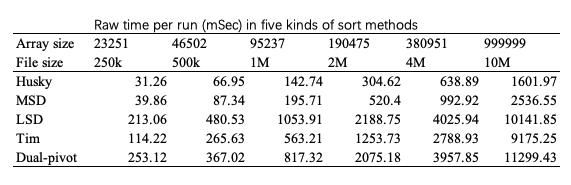

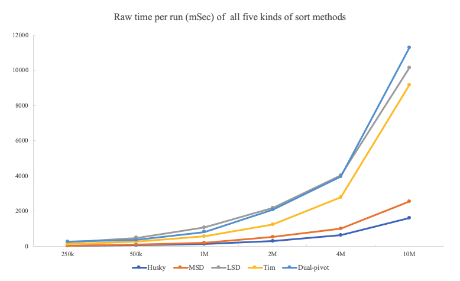

## Unit test result

#### MSD radix sort 

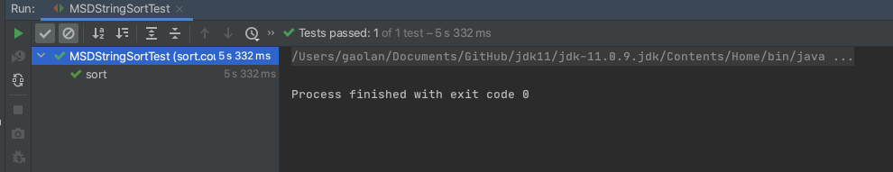

Benchmark

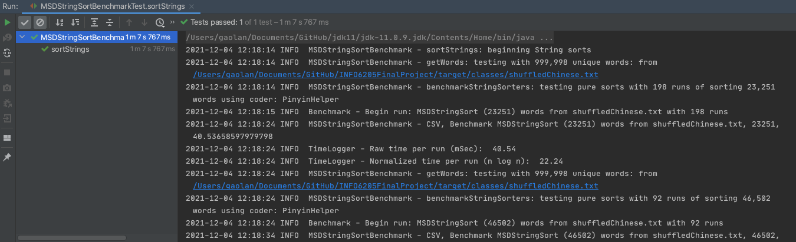

#### Timsort 

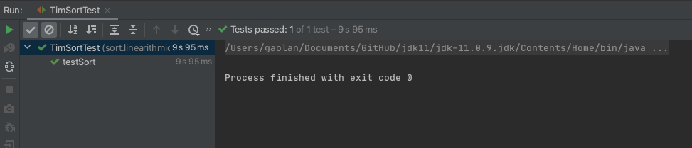

Benchmark

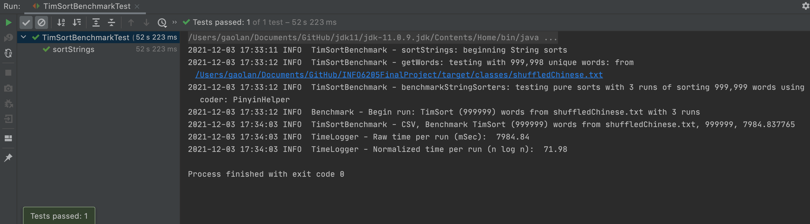

#### Dual-pivot Quicksort

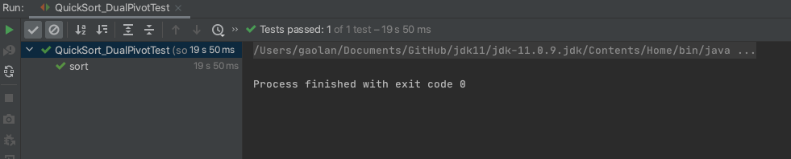

Benchmark

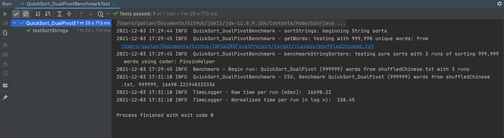

#### Huskysort 

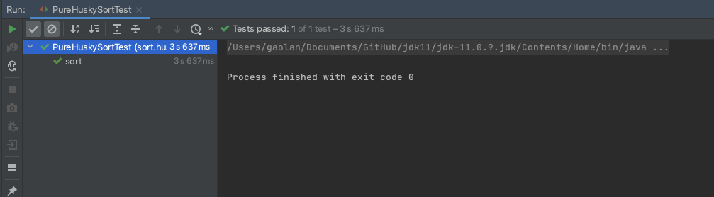

Benchmark

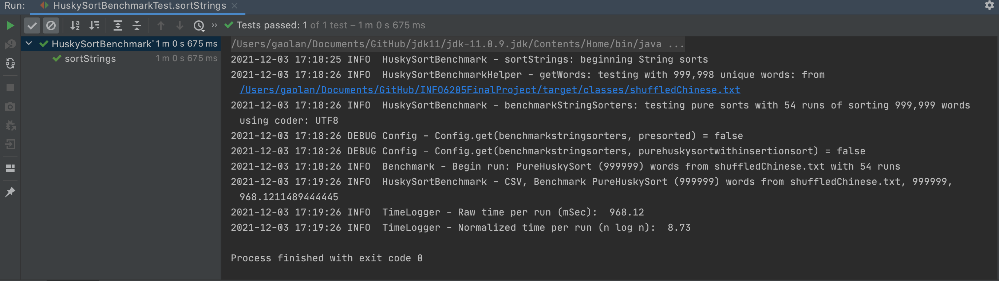

#### LSD radix sort 

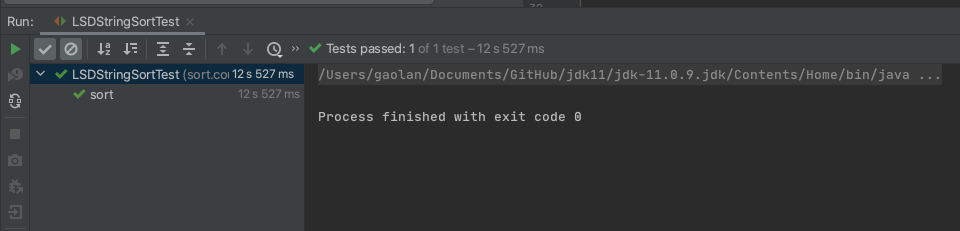

Benchmark

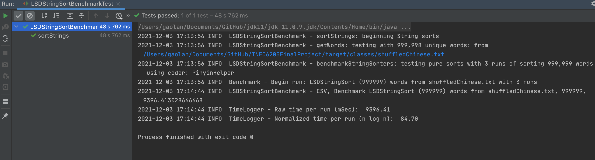